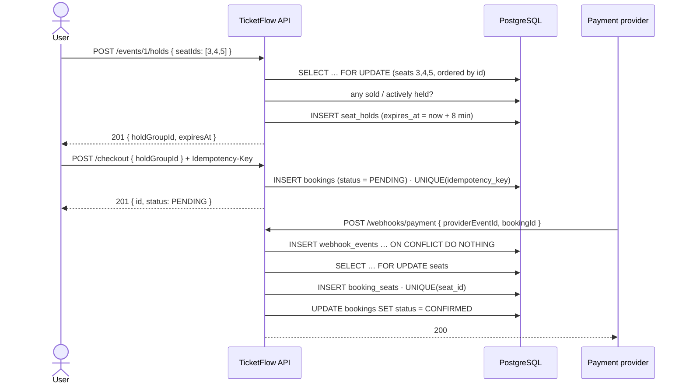
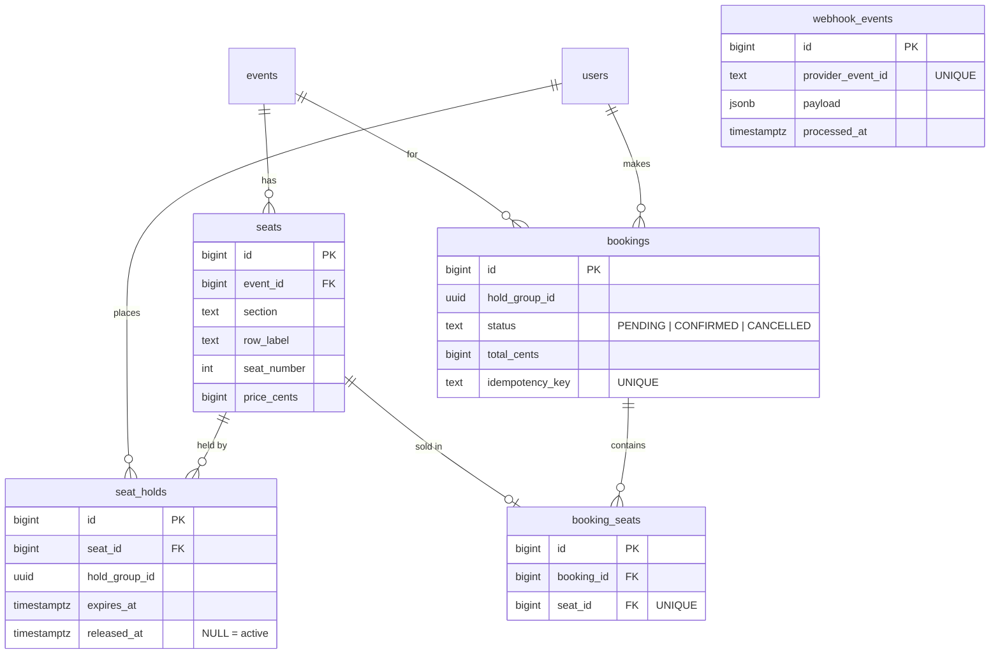

# TicketFlow

A seat-level event-ticketing backend that **never double-sells a seat** — not
when two people tap the same seat in the same millisecond, and not when the
payment provider delivers the same webhook five times.

**Java 21 · Spring Boot 4 · PostgreSQL 16 · Redis 7 · Flyway · JWT · tested against real Postgres with Testcontainers · load-tested with k6**

---

## What it does

Users browse events and see a live seat map. They select seats and get an
**8-minute hold**. If they pay within the window the seats are sold; if not, the
hold expires and the seats return to inventory automatically. Two users clicking
the same seat at the same moment resolve to exactly one winner. Payment webhooks
that arrive twice, out of order, or late are all handled without charging twice
or selling twice.

The design principle the whole project defends:

> **Correctness is enforced by database constraints, not application logic.
> Locking is the performance path; the constraints are the guarantee.**

---

## Architecture

```
        HTTP / JSON
            │
┌───────────▼───────────────────────────────────┐
│  Spring Boot app                               │
│                                                │
│  Controller  →  Service (@Transactional)  →  Repository
│  (HTTP only)    (business logic, locking)      (SQL)
│                                                │
│  JwtAuthenticationFilter · @Scheduled sweeper  │
└───────┬───────────────────────────────┬────────┘
        │                               │
   ┌────▼─────┐                   ┌──────▼──────┐
   │ Postgres │  source of truth  │   Redis     │  index only
   │   16     │                   │     7       │  (hold TTL keys)
   └──────────┘                   └─────────────┘
```

A single service, layered Controller → Service → Repository. Postgres is
authoritative; Redis is a best-effort index (every Redis call falls back to
Postgres on failure).

### The purchase flow



---

## Data model



Four constraints do the heavy lifting. Every layer above them can have a bug and
the database still refuses to break these:

| Constraint | Guarantees |
|---|---|
| `booking_seats` **UNIQUE (seat_id)** | A seat is sold **at most once, ever.** |
| `seat_holds` **UNIQUE (seat_id) WHERE released_at IS NULL** (partial index) | **One active hold per seat.** Two racing inserts → one wins, the other gets a unique-violation. |
| `bookings` **UNIQUE (idempotency_key)** | A retried checkout can't create a second booking. |
| `webhook_events` **UNIQUE (provider_event_id)** | A replayed webhook is recorded — and processed — once. |

Seat status (`AVAILABLE` / `HELD` / `SOLD`) is **derived** from these tables on
every read, never stored — a status column would eventually drift out of sync
with the tables that hold the truth.

Schema lives in versioned Flyway migrations
([`src/main/resources/db/migration`](src/main/resources/db/migration)); Hibernate
runs with `ddl-auto: validate` and never changes tables.

---

## The hard part: preventing a double-sell

Two requests read "seat 14 is free", both insert a hold, both proceed to sell.
Three ways to stop that:

| Approach | How | Trade-off |
|---|---|---|
| **Pessimistic lock** *(chosen)* | `SELECT … FOR UPDATE` on the seat rows (ordered by id) before checking availability; the loser blocks, then sees the winner's hold and gets `409` | An extra round-trip and a held lock per request; serialises access per seat. Predictable when everyone wants the *same* seat — which is this workload. |
| Optimistic lock | `@Version` column; both proceed, the second commit throws and retries | Great under low contention, a retry storm when many requests target one seat. |
| Insert-and-catch | Just insert; let the partial unique index reject the loser; catch `DataIntegrityViolationException` | Fewest moving parts, but weaker control of lock ordering for multi-seat requests and vaguer errors. |

**Chosen: pessimistic lock as the primary path, the partial unique index as the
backstop.** Seats are always locked in ascending id order, so two multi-seat
requests can't deadlock.

**Evidence:** `SeatHoldConcurrencyTest` fires 50 threads at one seat against a
real Postgres (Testcontainers) and asserts exactly one hold succeeds and exactly
one row lands in `seat_holds`.

---

## Hold expiry

A hold carries `expires_at`. Three mechanisms enforce it, in order of importance:

1. **Availability reads** treat `expires_at < now()` as free — the seat map is
   correct the instant a hold lapses, with no job having run.
2. **The hold flow self-heals** — before taking a seat it releases any expired
   hold on that seat (while holding the row lock), so a stale hold never blocks a
   fresh one.
3. **A `@Scheduled` sweeper** every 30s sets `released_at` on expired holds — a
   safety net that also runs once on startup, cleaning up anything that expired
   while the app was down.

Redis holds a key per hold group with a TTL equal to the hold length — a fast
"is this hold still alive?" check that never gates correctness.

---

## Checkout & idempotent webhooks

`POST /checkout` (with an `Idempotency-Key` header) creates a `PENDING` booking
from a hold group. No money moves; a fake payment provider then POSTs to
`POST /webhooks/payment` to confirm it.

- **Retried checkout** → same booking. `bookings UNIQUE (idempotency_key)` is the
  guarantee; the "already exists?" check is the fast path.
- **Duplicate webhook** → `webhook_events` is written first via
  `INSERT … ON CONFLICT (provider_event_id) DO NOTHING`; 0 rows written means
  "seen before, skip". The provider can deliver the same event 5× and get `200`
  every time, with exactly one booking confirmed. (`ON CONFLICT` rather than
  catching the unique violation, because a constraint error poisons the whole
  Postgres transaction.)
- **Confirming** turns holds into `booking_seats` rows in one transaction;
  `booking_seats UNIQUE (seat_id)` is the final backstop.
- **Late webhook** (hold already expired) → booking `CANCELLED`, no seats sold,
  `200` returned, and a "would refund here" line logged. The refund itself is out
  of scope (no real provider).

---

## API

| Method | Path | Auth | Description |
|---|---|---|---|
| `POST` | `/auth/register` | — | Create an account; returns a JWT |
| `POST` | `/auth/login` | — | Returns a JWT |
| `GET` | `/me` | Bearer | The current user |
| `GET` | `/events` | — | List events |
| `GET` | `/events/{id}/seats` | — | Seat map with derived `AVAILABLE` / `HELD` / `SOLD` + a summary |
| `POST` | `/events/{id}/holds` | Bearer | Hold a list of seats for 8 minutes — all-or-nothing (`409` if any is taken) |
| `POST` | `/checkout` | Bearer + `Idempotency-Key` | Create a `PENDING` booking from a hold group |
| `POST` | `/webhooks/payment` | — *(provider signature in a real system)* | Confirm or cancel a booking |
| `GET` | `/actuator/health` | — | Liveness (Postgres + Redis) |

Errors are RFC 9457 `application/problem+json`. Validation failures return `400`
with a per-field `errors` map.

### End to end, with curl

```bash
BASE=http://localhost:8080

# 1. register — grab the token
TOKEN=$(curl -s -XPOST $BASE/auth/register -H 'Content-Type: application/json' \
  -d '{"email":"demo@example.com","password":"supersecret1"}' | jq -r .token)

# 2. hold seats 3, 4, 5
HG=$(curl -s -XPOST $BASE/events/1/holds -H "Authorization: Bearer $TOKEN" \
  -H 'Content-Type: application/json' -d '{"seatIds":[3,4,5]}' | jq -r .holdGroupId)

# 3. checkout -> PENDING booking
BID=$(curl -s -XPOST $BASE/checkout -H "Authorization: Bearer $TOKEN" \
  -H 'Content-Type: application/json' -H 'Idempotency-Key: demo-001' \
  -d "{\"holdGroupId\":\"$HG\"}" | jq -r .id)

# 4. payment provider confirms it (send it 5x — still one booking, always 200)
curl -s -XPOST $BASE/webhooks/payment -H 'Content-Type: application/json' \
  -d "{\"providerEventId\":\"evt-001\",\"type\":\"payment_succeeded\",\"bookingId\":$BID}"

# 5. seats 3,4,5 now read SOLD
curl -s $BASE/events/1/seats | jq '.seats[] | select(.id<=5)'
```

---

## Performance

`loadtest/seat-rush.js` — **200 virtual users racing for 50 seats for 45 s**.
Each iteration holds a random seat and, on a win, checks out and confirms via the
webhook. Run locally: one JVM, one Postgres container, `maximum-pool-size: 30`.

| Metric | Result |
|---|---|
| Hold attempts | **19,113** in 45 s |
| Throughput | **~416 req/s** sustained |
| Hold latency | p50 **348 ms** · p90 752 ms · p95 **921 ms** *(lock-queue time — ~4 users contending per seat row)* |
| `409` rate | **99.7%** — correct under 4× oversubscription; the losers are being rejected |
| `5xx` | **0** — a k6 threshold; the run fails otherwise |
| Outcome | 50 seats held → 50 bookings confirmed |

Correctness check after the run:

```sql
SELECT seat_id, count(*) FROM booking_seats GROUP BY seat_id HAVING count(*) > 1;
--  (0 rows)      ← 50 distinct seats, each sold exactly once
```

**19,113 concurrent attempts · 0 seats oversold · 0 server errors.**
Reproduce with [`loadtest/`](loadtest/).

---

## Running locally

Requires **Java 21**, **Docker**, and **Docker Compose**.

```bash
docker compose up -d                          # Postgres 16 + Redis 7
./mvnw spring-boot:run                        # http://localhost:8080
curl http://localhost:8080/actuator/health    # {"status":"UP"}
```

```bash
./mvnw test        # unit + integration tests (Testcontainers — needs Docker running)
```

The JVM runs in UTC (`-Duser.timezone=UTC`, set in `pom.xml`); without it a
machine on a non-UTC locale can fail to connect to Postgres 16.

**Interactive API docs** once running: `http://localhost:8080/swagger-ui.html`
(spec at `/v3/api-docs`). Click **Authorize**, paste a JWT from `POST /auth/login`,
and every protected call in the UI sends it.

---

## Deploying

A `Dockerfile` + a Render Blueprint (`render.yaml`) provision the app, a managed
PostgreSQL, and a managed Redis-compatible store from this repo in one step — see
[`DEPLOY.md`](DEPLOY.md).

---

## Deliberately out of scope

Judgement calls, not omissions:

- **Refund execution** — the late-webhook path logs "would refund here"; wiring a
  real provider is not part of a self-contained demo.
- **Kafka / event-driven read models** — designed (transactional outbox → a
  replayable `SalesStats` read model), deferred. The throwaway "publish an event,
  log a fake email" version isn't worth the broker.
- **Auth hardening** — no refresh-token rotation, OAuth, or email verification.
  Auth here is table stakes, not the story.
- **Rate limiting** on login and holds.
- **A frontend** — this is a backend project.
- **Horizontal read scaling** (replicas, CQRS) — single Postgres is plenty here.

---

## Build log

| Phase | |
|---|---|
| 0 | Scaffolding — boots, connects to Postgres + Redis, Flyway wired |
| 1 | Domain model, migrations, seed (1 event, 500 seats) |
| 2 | Auth — register / login, stateless JWT, `401` on missing token |
| 3 | Read APIs — events list, seat map with derived status |
| 4 | Seat holds — pessimistic lock, all-or-nothing, 50-thread concurrency test |
| 5 | Hold expiry — read-time check + self-heal + `@Scheduled` sweeper + Redis TTL |
| 6 | Checkout + idempotent webhooks — `Idempotency-Key`, `ON CONFLICT` log, late-webhook cancel |
| 7 | Kafka — **cut** (see *Deliberately out of scope*) |
| 8 | Load test — 200 VUs / 50 seats, ~416 req/s, p95 921 ms, 0 oversold, 0 `5xx` |
| 9 | README polish + Swagger UI + Docker/Render deploy prep |

> Built on Spring Boot 4.1 rather than the 3.x the plan assumed —
> `start.spring.io` no longer generates 3.x projects.
